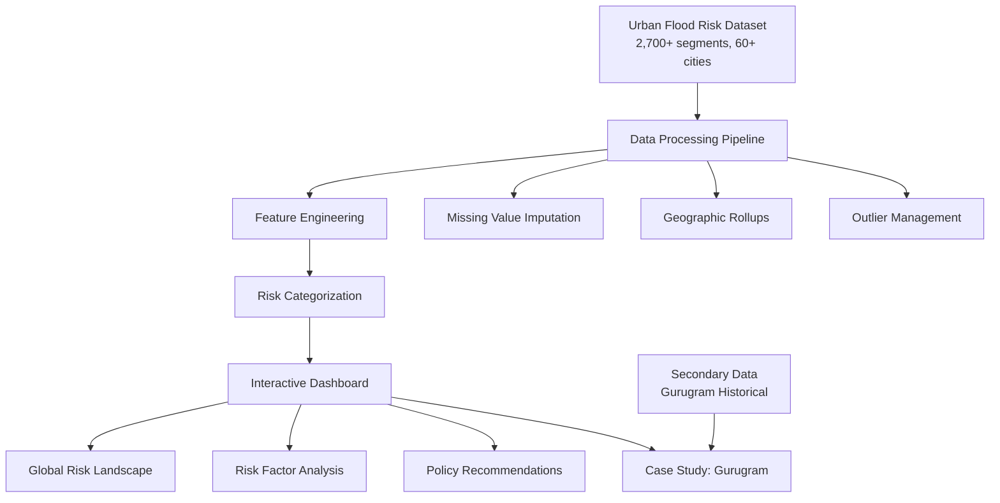
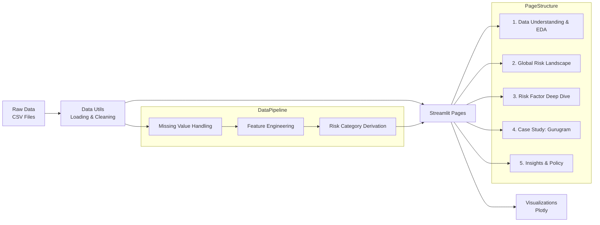
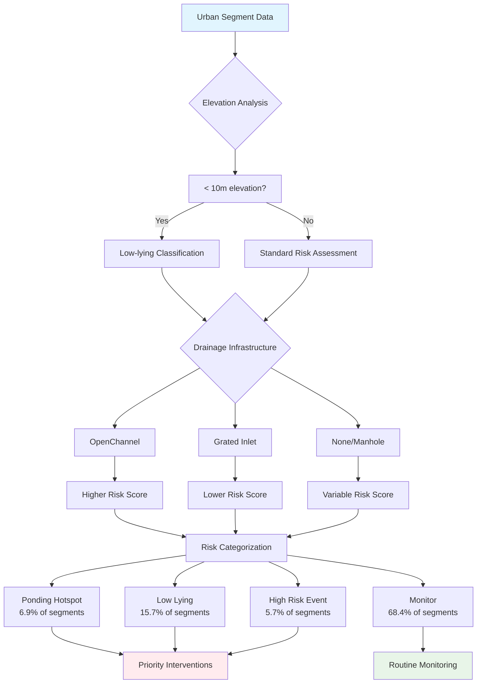
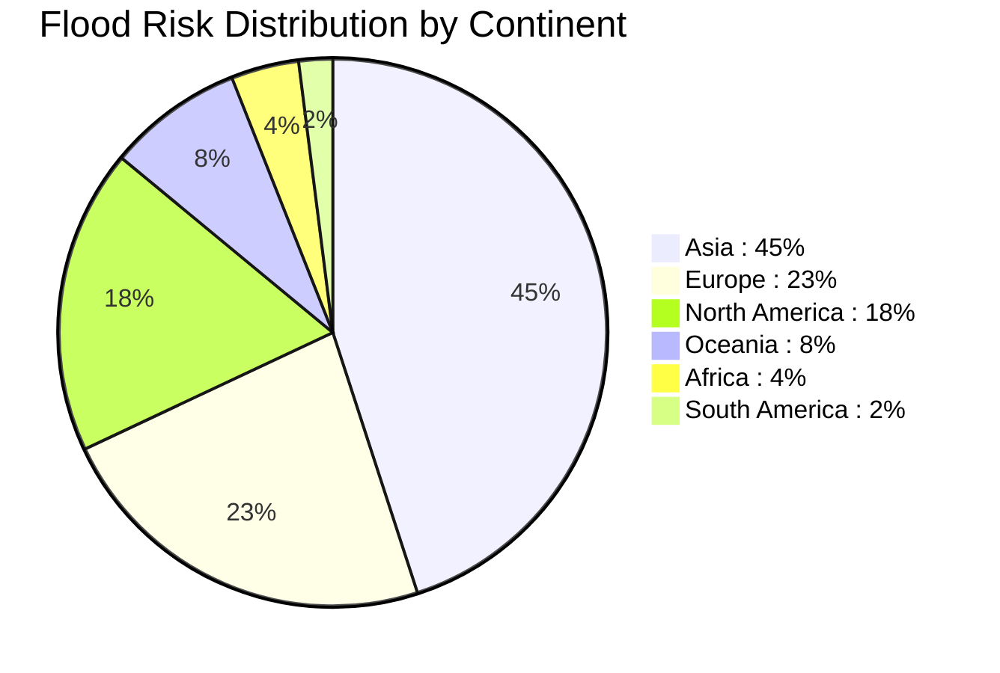

# Urban Pluvial Flood Risk Analytics

## [View Project Here ->](https://urban-flood-analytics.streamlit.app/)  
**Team Codezilla**

Nikhil Sharma, Shwetank Pandey, Rayyan Khan

Built for Deep Data Hackathon 2.0

## Overview

Urban flooding causes over $40 billion in damages annually worldwide, yet cities continue to rely on reactive approaches that only address problems after disasters strike. Our solution transforms flood risk assessment from reactive to predictive through comprehensive data analysis of urban segments across global cities.

This interactive dashboard serves as a decision support system for urban planners, civil engineers, and municipal agencies. By analyzing patterns in flood-prone areas through exploratory data analysis, we provide actionable insights that help cities build resilience before emergencies occur.

## The Challenge

Urban pluvial flooding (rainfall-driven flooding) represents one of the most complex challenges facing growing cities. Traditional assessment methods are fragmented, often missing critical vulnerabilities until flooding events reveal them through costly damage. Our team tackled this challenge by developing a systematic approach to identify and prioritize flood risks using data-driven methodologies.

We focused on creating transparency in flood risk assessment, avoiding black-box machine learning approaches in favor of clear, explainable analytics that policymakers can trust and implement immediately.

## Dataset Details

### Primary Dataset: Urban Pluvial Flood Risk
**File**: `urban_pluvial_flood_risk_dataset.csv`

Our main analysis centers on a comprehensive synthetic dataset containing 2,000+ urban road segments from over 50 global cities. This dataset mirrors real-world urban flood assessment data used by organizations like the World Bank's Urban Flood Resilience program.

**Geographic Coverage**: Cities across all continents including Mumbai, Chennai, Houston, Miami, Lagos, London, Barcelona, Tokyo, Sydney, and many others.

**Key Features**:
- **Location Data**: Latitude, longitude, city names with derived country and continent information
- **Topography**: Elevation measurements from various DEM sources (SRTM, Copernicus)
- **Infrastructure**: Storm drain types (grated inlets, open channels, manholes), drainage density, proximity to formal drainage
- **Hydrology**: Soil infiltration groups (A, B, C, D), historical rainfall intensity, return periods
- **Land Use**: Residential, commercial, industrial, green spaces, institutional areas
- **Risk Classification**: Primary risk categories derived from complex risk labels

**Risk Categories**:
- **Ponding Hotspot**: Areas with recurring water accumulation
- **Low Lying**: Topographically vulnerable segments
- **High Risk Event**: Areas prone to extreme rainfall events
- **Monitor**: Lower risk areas requiring ongoing observation

### Secondary Dataset: Gurugram Case Study
We supplemented our global analysis with detailed local datasets for Gurugram, India, demonstrating how our framework applies to specific urban contexts:

- **Historical Analysis**: Water body changes from 1956 to 2024
- **Land Cover Evolution**: Built-up area expansion and green space loss
- **Infrastructure Assessment**: Current drainage systems and capacity gaps
- **Ecological Context**: Integration with Aravalli Biodiversity Park restoration efforts

This case study validates our global findings against real urban development patterns and provides a template for local implementation.

## Technical Architecture

### System Architecture Overview



### Data Flow Architecture



### Risk Assessment Workflow



### Global Impact Distribution



### Application Structure

**Core Application**:
- `app.py`: Main dashboard with project overview and key performance indicators
- `pages/1_Data_Understanding_and_EDA.py`: Comprehensive exploratory data analysis with 10+ targeted research questions
- `pages/2_Global_Risk_Landscape.py`: Interactive world map and city-level risk comparisons
- `pages/3_Risk_Factor_Deep_Dive.py`: Detailed analysis of topography, infrastructure, and hydrology factors
- `pages/4_Case_Study_Gurugram.py`: Local implementation example with downloadable datasets
- `pages/5_Insights_and_Policy.py`: Actionable recommendations derived from data insights

**Supporting Infrastructure**:
- `utils/data_utils.py`: Optimized data loading, cleaning, and feature engineering functions with caching
- `utils/style.py`: Consistent color palettes and CSS styling for professional presentation
- `requirements.txt`: All necessary Python dependencies for reliable deployment

### Data Processing Pipeline

**Data Preparation**:
1. **Quality Assurance**: Missing value imputation using median (elevation) and mode (soil groups)
2. **Data Type Standardization**: Numeric coercion for coordinates, elevation, drainage metrics
3. **Feature Engineering**: Geographic rollups (country, continent) and risk category derivation
4. **Outlier Management**: Configurable clipping to 1st-99th percentile ranges
5. **Duplicate Handling**: Optional deduplication by segment identifiers

**Analysis Framework**:
Our exploratory data analysis follows a structured approach with 10 targeted research questions:
1. Risk category distribution patterns
2. Elevation relationships across risk levels
3. Rainfall intensity and topographic interactions
4. Land use vulnerability assessment
5. Soil group risk profile analysis
6. Drainage density impact evaluation
7. Storm drain accessibility patterns
8. City-level risk concentration analysis
9. Continental risk distribution trends
10. Feature correlation mapping

### Visualization Strategy

All visualizations use Plotly for interactive exploration with hover tooltips, filtering capabilities, and responsive design. Our color palette maintains consistency across all charts while ensuring accessibility.

**Interactive Elements**:
- Dynamic filtering by city, risk category, and geographic region
- Animated scatter plots showing temporal patterns
- Correlation heatmaps with drill-down capabilities
- Geographic scatter plots with customizable sizing and coloring

## Key Findings

Our analysis revealed several critical insights that inform flood mitigation strategies:

**Universal Patterns**:
- Elevation below 10 meters combined with high rainfall intensity creates predictable flood vulnerabilities
- Distance from formal storm drainage infrastructure directly correlates with flood risk occurrence
- Clay-heavy soils (Groups C and D) in low-lying areas consistently produce ponding hotspots
- Grated inlet systems significantly outperform open channel drainage in risk reduction

**Geographic Insights**:
- Commercial and residential land uses dominate high-risk segment exposure across all continents
- Urban development patterns show consistent relationships between built-up density and flood vulnerability
- Infrastructure gaps follow similar patterns regardless of geographic location or economic development level

**Policy Implications**:
These findings translate into five concrete policy recommendations that cities can implement within 90 days:
1. Prioritized infrastructure upgrades in identified low-lying, high-rainfall areas
2. Data-driven zoning policies restricting development in vulnerable basins
3. Nature-based solutions emphasizing permeable surfaces in poor-drainage soil zones
4. Systematic maintenance protocols for existing drainage infrastructure
5. Early warning systems with community monitoring in recurring hotspot areas

## Installation and Setup

### System Requirements
- Python 3.8 or higher
- 4GB RAM minimum (8GB recommended for large datasets)
- Modern web browser with JavaScript enabled

### Installation Steps

1. **Clone or Download** the project to your local machine

2. **Navigate** to the project directory:
   ```bash
   cd path/to/dataaa
   ```

3. **Create Virtual Environment** (strongly recommended):
   ```bash
   python -m venv flood_risk_env
   ```

4. **Activate Virtual Environment**:
   - **macOS/Linux**: `source flood_risk_env/bin/activate`
   - **Windows**: `flood_risk_env\Scripts\activate`

5. **Install Dependencies**:
   ```bash
   pip install -r requirements.txt
   ```


### Running the Application

1. **Launch Dashboard**:
   ```bash
   streamlit run app.py
   ```

2. **Access Interface**: Your browser should automatically open to `http://localhost:8501`

3. **Navigate Pages**: Use the sidebar to explore different analysis sections

### Troubleshooting

**Common Issues**:
- **Port Conflicts**: If port 8501 is busy, Streamlit will suggest alternatives
- **Memory Issues**: For large datasets, increase system memory or reduce data scope
- **Browser Compatibility**: Use Chrome, Firefox, or Safari for optimal experience
- **Package Conflicts**: Fresh virtual environment resolves most dependency issues


## Project Impact

This dashboard transforms flood risk assessment from academic exercise to practical implementation tool. Cities can use our framework to:

**Immediate Applications**:
- Identify vulnerable neighborhoods before flooding occurs
- Prioritize infrastructure investment based on data-driven risk assessment
- Develop evidence-based zoning policies that prevent future vulnerabilities
- Create maintenance schedules targeting high-impact drainage improvements

**Long-term Benefits**:
- Systematic approach to urban resilience planning
- Transparent methodology that builds public trust in flood preparedness
- Scalable framework applicable to cities regardless of size or economic status
- Integration potential with existing urban planning workflows


## Future Enhancements

Our roadmap includes several advanced features:
- **Scenario Modeling**: Synthetic storm intensity testing for infrastructure planning
- **Capacity Analysis**: Detailed drainage retrofit modeling with cost-benefit calculations
- **Spatial Integration**: Basin and catchment analysis for neighborhood-scale interventions
- **Real-time Integration**: API connections for live weather and sensor data
- **Mobile Optimization**: Responsive design for field use by urban planners

## Data Sources and Acknowledgments

This project utilizes synthetic datasets designed to mirror real-world urban flood assessment data. The methodology reflects approaches used by organizations including the World Bank Urban Flood Resilience program, municipal engineering departments worldwide, and academic research in urban hydrology.

Special recognition to the Deep Data Hackathon 2.0 organizers for providing this opportunity to apply data science techniques to critical urban challenges.

## License and Usage

This project is developed for educational and research purposes as part of the Deep Data Hackathon 2.0. The methodology and code structure can be adapted for actual urban planning applications with appropriate real-world datasets and validation.

For questions about implementation or collaboration opportunities, please contact Team Codezilla.
